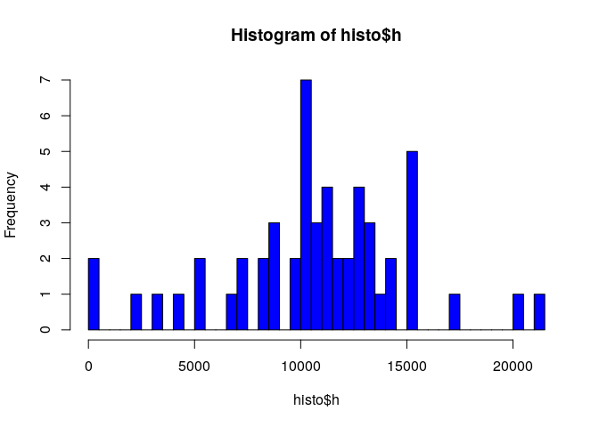
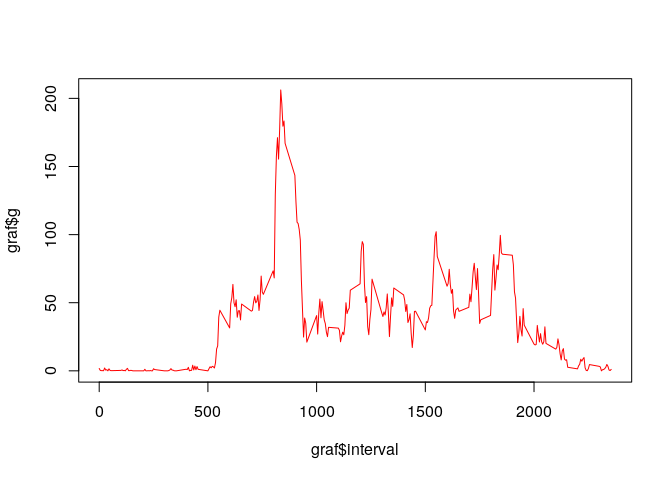
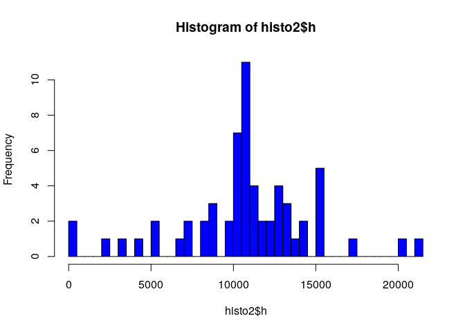
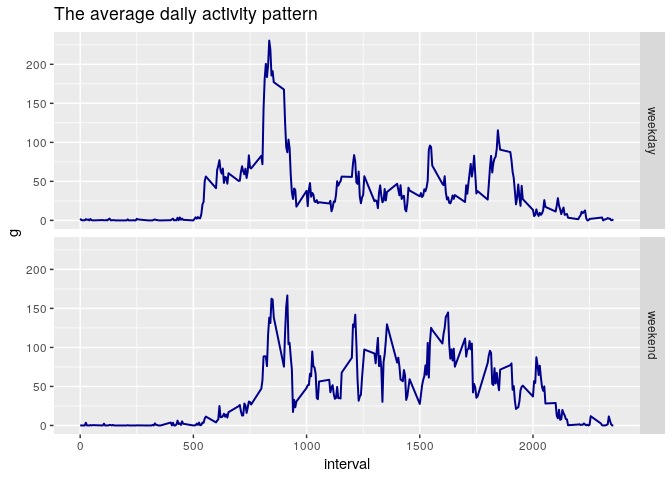

## Loading and preprocessing the data


```r
DL.data <- function (){
  if (!file.exists("data")) {
    message("Creating Data folder in working directory")
    dir.create("data")
    unzip("activity.zip", exdir = "data")
    unlink("activity.zip")
  }
  else message("data already exists")
}

library(plyr)
library(dplyr)
library(ggplot2)

DL.data()
```

```
## data already exists
```

```r
actdata <- read.csv("data/activity.csv", header = TRUE, sep = ",")
actdata <- actdata[complete.cases(actdata),]
actdata$date <- as.Date(actdata$date, format = "%Y-%m-%d")
```

## What is mean total number of steps taken per day?


```r
histo <- actdata %>% group_by(date) %>% summarize(h = sum(steps))
hist(histo$h, nclass = length(histo$date), col = "blue")
```

<!-- -->

```r
summary(histo$h)[3:4]
```

```
##   Median     Mean 
## 10765.00 10766.19
```

## What is the average daily activity pattern?


```r
graf <- actdata %>% group_by(interval) %>% summarize(g = mean(steps))
plot(x = graf$interval, y = graf$g, type = "l", col = "red")
```

<!-- -->

```r
graf[graf$g==max(graf$g),1]
```

```
## # A tibble: 1 x 1
##   interval
##      <int>
## 1      835
```

## Imputing missing values


```r
actdata <- read.csv("data/activity.csv", header = TRUE, sep = ",")
actdata$date <- as.Date(actdata$date, format = "%Y-%m-%d")
sum(as.logical(rowSums(is.na(actdata))))
```

```
## [1] 2304
```

```r
f <- graf$g
names(f) <- graf$interval
actdata[which(is.na(actdata$steps)),1] <- f[as.character(actdata[which(is.na(actdata$steps)),3])]

histo2 <- actdata %>% group_by(date) %>% summarize(h = sum(steps))
hist(histo2$h, nclass = length(histo2$date), col = "blue")
```

<!-- -->

```r
summary(histo2$h)[3:4]
```

```
##   Median     Mean 
## 10766.19 10766.19
```

## Are there differences in activity patterns between weekdays and weekends?

```r
actdata2 <- mutate(actdata, day = weekdays(date))
actdata2$day.type <- factor(ifelse(actdata2$day %in% c("sábado", "domingo"), "weekend", "weekday"))
actdata2 <- actdata2 %>% group_by(day.type, interval)
j <- summarize(actdata2, g = mean(steps))
a <- ggplot(j, aes(x = interval, y = g))
a + geom_line(color = "darkblue", lwd=0.7) + 
  ggtitle("The average daily activity pattern")+
  facet_grid(day.type ~.)
```

<!-- -->
